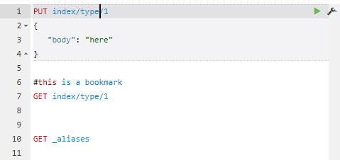

# **Webcurl help**

[toc]

### Request format

You can type one or more requests in the white editor. Webcurl understands requests in a compact format:

 

Resize the editor pane by dragging the splitter-bar between the 2 panes.


### Execute a request

You can execute the current request by pressing Ctrl-Enter, or by clicking on the green triangle next to the request.

If the request is executed, the saveset (see later) is saved. Since a saveset holds a list of servers, that list can grow pretty big. You can remove servers from that list by opening the list and then right-click on the server that you want to remove.

The native response might be changed by 1 or more response plugins. See later.

If you want to send file bytes in a POST/PUT/DELETE command, it is possible to reference the filename in the body. WebCurl will intercept the reference, read the requested file and send the file-bytes as body instead. The syntax is like this:
```
{
   "_file_body": {
      "file": "some file",
      "type": "some mimetype"
   }
}
```
For common files like images, the mime-type is internally known and you can omit the 'type'.


### Server types

A server type is called an "endpoint" in the settings.xml. The selection of an endpoint is done via regular expressions on the server name.

An endpoint determines properties like:

- proxy type (or none)
- autocomplete provider
- available templates
- custom headers
- select output plugins

 See the settings.xml for more information.


### Autocomplete

Autocomplete is implemented by 

- **autocompleting the url** as you type
  If autocomplete is not showing, you can force it via Ctrl-Shift-space.
  Pressing tab or enter will insert the selected value.
- **Insert templates** into the request body
  This is activated by pressing Ctrl-Shift-Space while the cursor is in the body of the request.
  Pressing tab or enter will insert the selected template.
- **Insert field- and index-names** into the body
  This is activated by pressing Ctrl-Shift-F or  Ctrl-Shift-X respectively.

All functionality is dependent on an autocomplete supplier that is present in the plugins directory.
Out of the box, a supplier for ElasticSearch servers is provided. For other types of servers have a look at the file "plugins/sample_index_mapper".

Template collections are simply named json files. You can specify to support 1 or more collections per server type (see settings.xml)


### Savesets or command collections

Savesets are particular handy if you have different customers, different server-types, different use cases, etc. It is a way of organizing your requests, since the collection will grow over time.

A saveset has a list of most recently used servers and requests. By selecting a saveset, the server textbox and the command window are automatically updated.

You can choose a new saveset by entering a new name in the saveset textbox. A copy of the current saveset will be saved under the new name. 


### Bookmarks

If you enter a line, starting with a '#', that line is treated as a bookmark.

Selecting a saveset will scan the current command window for bookmarks and present them in the bookmarks box. If you select a bookmark from that box, the command window is navigated to that bookmark.


### Navigating

Every action that you do is saved on a history stack. You can navigate backward and forward through this stack by pressing the <== or ==> button.
The history works not only within a saveset, but also over different savesets.


### Indenting

You can autoindent (format) a complete request body by pressing Ctrl-I.

However, if you want to autoindent only a part of the body, place the cursor in the scope (array or object) that you want to autoindent and then press Ctrl-Shift-I.

Autoindenting is implemented by toggling: first the json is formatted pretty. If that didn't change the existing json text, the json is formatted raw.


### Copy/paste in cUrl format

Pasting a command in cUrl format is automatically detected and inserted as a standard Webcurl request.

If you want to copy the current request in cUrl format, you can click on the little wrench next to the request, or use the keyboard: Ctrl+Shift+C.


### Response plugins

Response plugins can reformat the returned response. Out of the box WebCurl comes with explain prettyfiers and summarizers that generate a summary at the top of the output.

Example of a summary:

```
"summary": [
      "3.676 - {'partial_filename':'2020/2020-01-18 Berkelpad Coesfeld-Draum.gpx','meta':{'title':'Berkelpad Coesfe",
      "3.676 - {'partial_filename':'2020/2020-01-17 Berkelpad Gesher-Coesfeld.gpx','meta':{'title':'Berkelpad Geshe",
],
   
```

Example of a pretty explain:

```
"_explanation": [
   "0.057, meta.type:track in 0",
   "-- 0.057, score(freq=1.0), product of",
   "-- -- 2.200, boost",
   "-- -- 0.057, idf, computed as log(1 + (N - n + 0.5) / (n + 0.5)) from",
   "-- -- -- 432.000, n, number of documents containing term",
   "-- -- -- 457.000, N, total number of documents with field",
   "-- -- 0.455, tf, computed as freq / (freq + k1 * (1 - b + b * dl / avgdl)) from",
   "-- -- -- 1.000, freq, occurrences of term within document",
   "-- -- -- 1.200, k1, term saturation parameter",
   "-- -- -- 0.750, b, length normalization parameter",
   "-- -- -- 1.000, dl, length of field",
   "-- -- -- 1.000, avgdl, average length of field"
],

```

Since these plugins are server-type specific, you can either (de-)select them to be active from an endpoint (settings.xml), or make sure that the plugin does nothing for responses that it doesn't understand.


### Keyboard shortcuts

| Key              | Function                               |
| ---------------- | -------------------------------------- |
| Ctrl/Cmd+I       | Auto indent current request            |
| Ctrl/Cmd+Shift+I | Auto indent current scope              |
| Ctrl/Cmd+Enter   | Submit request                         |
| Ctrl+Space       | Open Autocomplete (even if not typing) |
| Ctrl/Cmd+Shift+F | Autocomplete field name                |
| Ctrl/Cmd+Shift+X | Autocomplete index name                |
| Ctrl/Cmd+Shift+C | Copy request in cUrl format            |
| Ctrl+Up          | Goto previous request                  |
| Ctrl+Down        | Goto next request                      |


When autocomplete is visible:

| Key              | Function                               |
| ---------------- | -------------------------------------- |
| Enter/Tab        | Select the currently selected or the top most term in auto-complete menu |            |
| Esc              | Exit autocomplete             |
| R-mouse click   | Remove item from the server list                         |


### Settings.xml

The settings.xml contains the settings for the webcurl server.

Webcurl uses onchange notifications for the settings.xml as well as for the templates. If there is a change, the next request will automatically force a reload of the server settings.

Note however that some of the settings are propagated to the browser. So you might need to refresh the browser as well.


### Customize templates

Templates are basically json objects, stored in the template folder.
Such a json file contains multiple templates, keyed by the name.
If an endpoint specifies multiple template collections, the template collections are combined into one, where an earlier template will take precedence.

Example: if you specify "my_template,es", and both collections contained a template for a 'match' query, the template 'match' from 'my_template' is used. 

In the settings.xml:

```
   <endpoint name="default" autocomplete="es" templates="my_template,es" >
         <selectors>
            <select expr="." />
         </selectors>
      </endpoint>
   </endpoints>
```

For the rest, creating a template is pretty much self explaining if you look at a supplied template. The only thing worth mentioning is the pretty value. If this is supplied and true, the template will be pretty-formatted and then inserted. Otherwise the template is inserted as unformatted json.

As an example a template-collection with 1 template (named 'agg_terms'):

```
 {   
    "agg_terms": {
        "pretty": true,
        "template_json": {
           "NAME": {
              "terms": {
                "field": "FIELD",
                "size": 10,
                "show_term_doc_count_error": true
              }
           }
        }
    }
 }   
```

