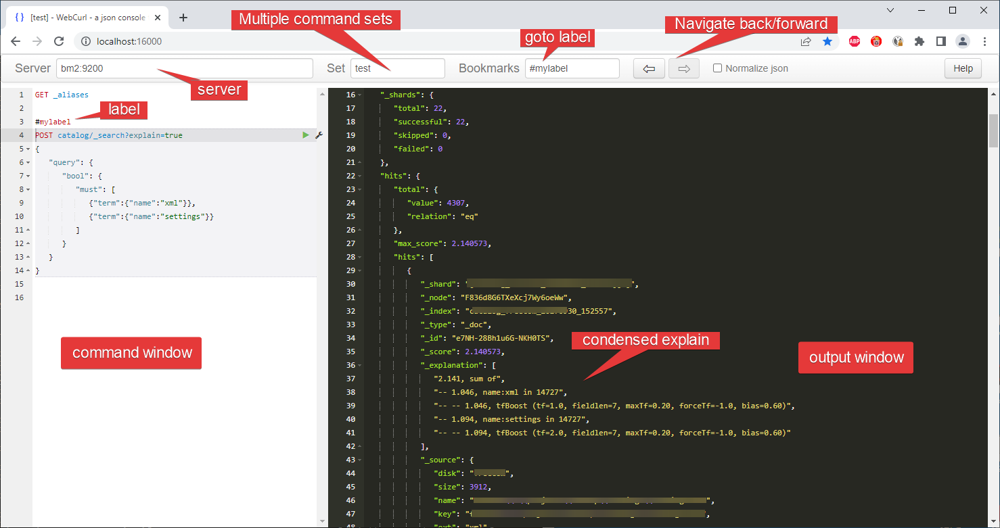

# WebCurl
## Purpose

WebCurl is an interface to play with Json API's. It is much like the Kibana command-line interface for ElasticSearch, or the Postman application. However, additionally it supports:

- multiple source sets
- navigation through the commands that you issued (back & forward)
- bookmarks in your commands
- proxy servers
- customizable headers
- customizable autocomplete providers
- customizable templates for easy command building
- customizable output processing. Think of
  - better explain formatting
  - ordering of json-elements
  - creating a summary of the results
  - etc

Webcurl is hosted by a local java webserver and runs in every recent browser.


## Screenshot




## Installation

Just unzip the archive from a release into a local directory.
At least java 8 is needed to run the webserver.

You can launch the server by

```
java -jar "target\BMCurlServer.jar"
```

Once launched, you can browse to http://localhost:16000 (by default) and see the UI.

If the server is started for the very first time, it will create the settings.xml file as well as the storage directory (where your command sets are saved)


## Customizability

WebCurl supports some limited plugins (in the plugins-directory).

These plugins can be used to

- modify the json-output (think of summarizers, explain formatters, etc)
- autocomplete suppliers for autocomplete on url's, fields or index names.

Also you can specify/create templates. Templates are json-pieces that can be injected in the command-body. Templates and autocomplete suppliers are specific for on endpoint (server).

For customizations of the settings, like the port where the server is running, see the settings.xml file.


## History

I tend to use Sense a lot. It was a very easy interface to ElasticSearch's API. It was so handy that I missed it a lot when accessing other API's. It was possible to use a different API, but sometimes I needed to edit the source code of Sense.

Also it had some shortcomings. It wasn't easy to separate your history from multiple customers, and it wasn't easy digging in large histories.

This is where I started to create WebCurl. Heavily influenced by  Sense.
To get rid of the limitations of a Chrome plugin, I started with a local webserver, supporting the same logic as Sense did.

Having a local webserver also removed the burden of CORS problems and it opened many possibilities. 

The web application is no longer bound to ElasticSearch. It can be used for most json-api servers.  


## Credits

Many credits go to Boaz Leskes, the creator of Sense. He created this very easy interface to Elasticsearch. It gave me a jump start when learning ElasticSearch. And again when I was creating WebCurl.
